# Commands in PhpStorm

- [Starting a project](#starting-a-project)
- [Day-to-day work](#day-to-day-work)
- [Branching model](#branching-model)
- [Review your work](#review-your-work)
- [Synchronizing repositories](#synchronizing-repositories)
- [Temporary commits](#temporary-commits)
- [Tagging known commits](#tagging-known-commits)

This document has a similar structure to the [readme.md](readme.md). However,
here the Git commands are exchanged with descriptions and screenshots of the
corresponding PhpStorm UI operations.

## Starting a project

### Clone

- Open your PhpStorm IDE and navigate to "Git > Clone" in the top menu.
- Enter your project URL and select your working directory. Be aware that this
  directory can vary depending on your development setup (cf. WSL for local
  docker development).
- Click "Clone".

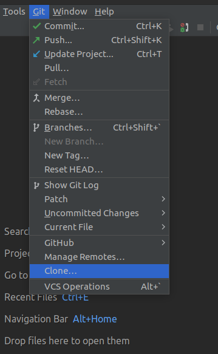

## Day-to-day work

### Status

- In your project tree you see the state of your files based on their colors.
    - **Ignored (yellow)**: This file is ignored based on the .gitignore file.
    - **Untracked (red)**: This file exists locally, but isn’t a part of the Git
      repository. Also, it will not be within the next commit. Use `git add` to
      stage the file for the next commit.
    - **New (green)**: This file will be committed but is new to the repository.
    - **Modified (blue)**: This file is already part of the repository but has
      changed since the last commit. That change will be committed.
    - **Deleted (grey)**: This change is in the repository but we be removed
      from it in the next commit.
    - **Unchanged**: This file has no changes since the last commit.

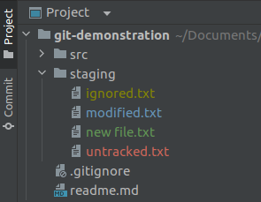
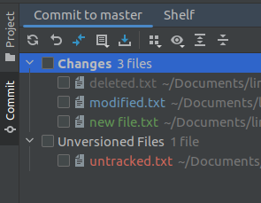
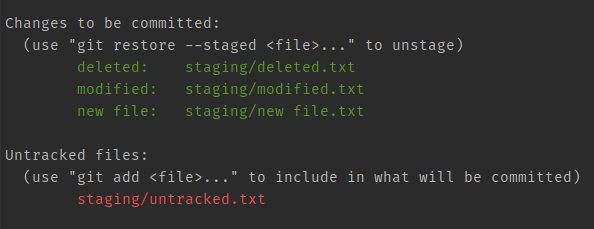

### Commit

- You can choose between "commit dialog" and "non-modal commit interface" (use
  second choice if in doubt)
- Select the files that you want to check into the repository (also stubs of a
  file are possible)
- Add a descriptive commit message
- Click "Commit" or "Commit and Push" (update the project before you push)
- Further advice:
    - Additionally you could select the option the run a code analyzer before
      the commit and further tools but I would advise against it. You could use
      a more sophisticated pipeline or similar tools for that.
    - Do not use "After commit upload files to". High risk to overwrite other
      changes. Let a pipeline do that for you.

### Add

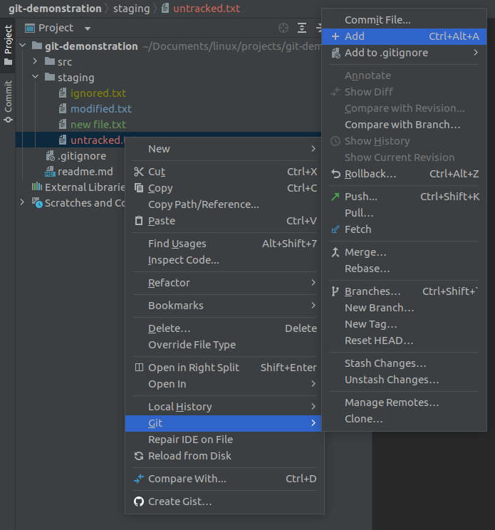
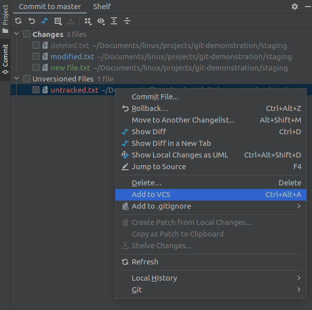

### Remove

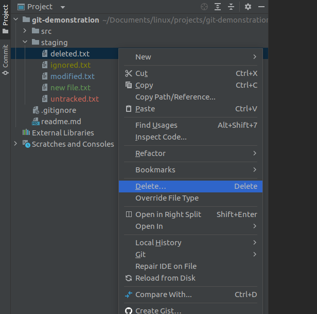

### Rename

- Just rename the file. PhpStorm and Git will do that for you.

### Diff

- Use the colored part right of the line numbers to see or discard changes.
- Double click the files in the commit interface to see a diff view.
    - You can choose between a side-by-side viewer and a unified viewer.
    - You can change how to handle white spaces.
    - You can collapse unchanged fragments which is useful for longer files.

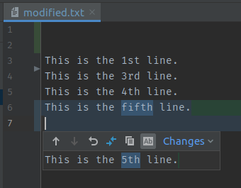
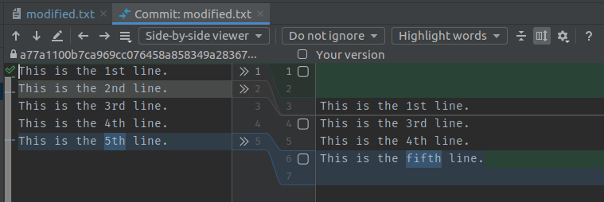

### Rollback

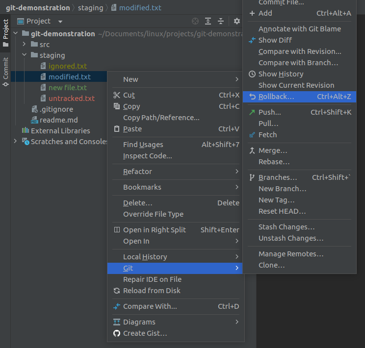
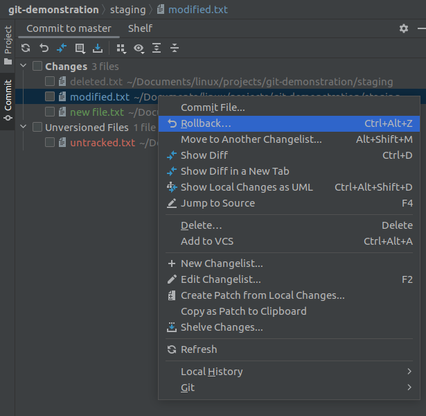

## Branching model

- All of the branching operations can be found in the Git tab (`Alt+9`) or in
  the bottom right corner. You can see the local and the remote branches.

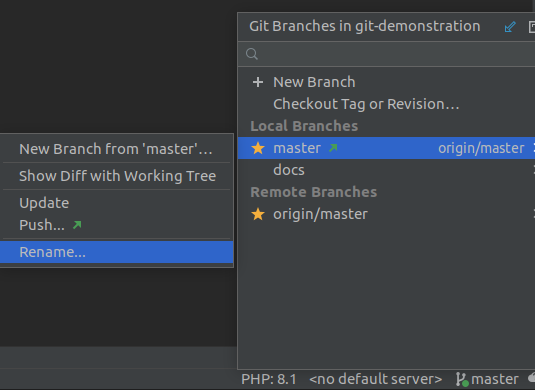

## Review your work

- The best option to see all the changes is with the Git tab (`Alt+9`). There
  you can navigate and filter through all the commits of all branches.

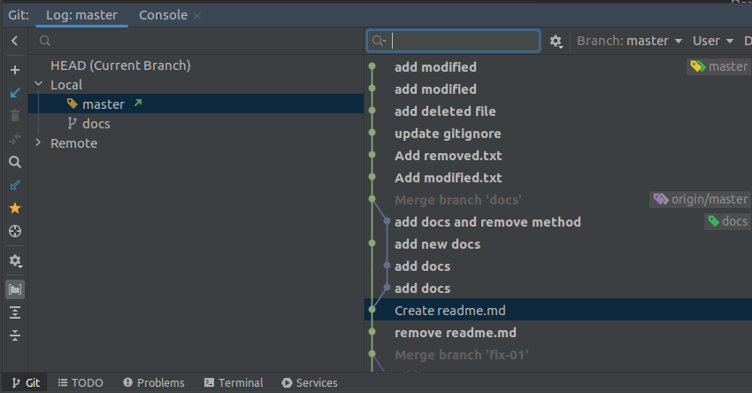

## Synchronizing repositories

- There are several options to achieve the remote operations. All of them can
  perform approximately the same: 
    - Main menu under Git
    - Git tab
    - Branch selection in the bottom right
    - Task menu to the right
- Always try to update your project before you commit and push. With this
  strategy you can avoid additional merge commits and potentially conflicts
  during the merge.

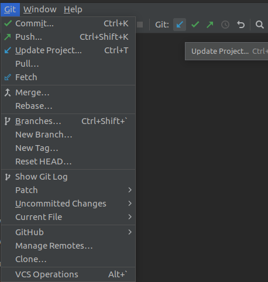

## Temporary commits

- PhpStorm provides an even better way than stashing your changes and calls that
  concept "shelves". It also stores your changed files and will apply them again
  when you unshelve. You can also choose which specific parts of a file you want
  to shelve.

## Tagging known commits

- In the Git tab right click any commit and select "New Tag...". Be sure to also
  select "Push tags" once you push your code.
