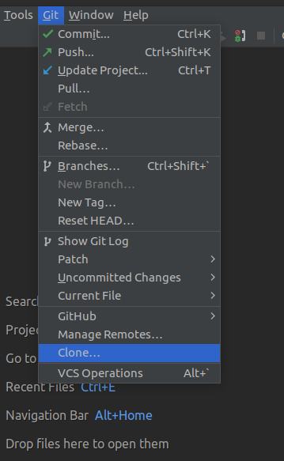
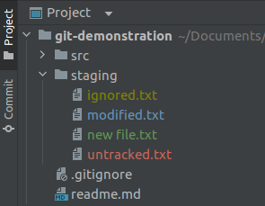
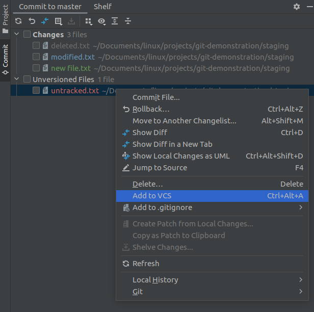
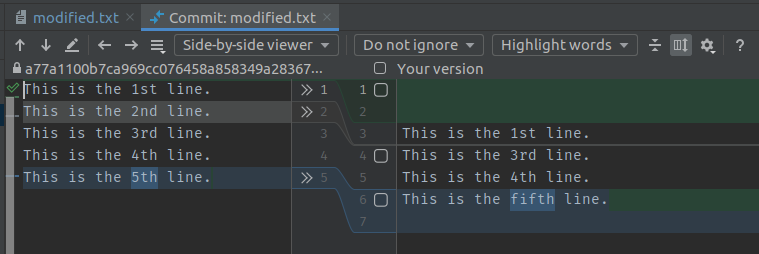
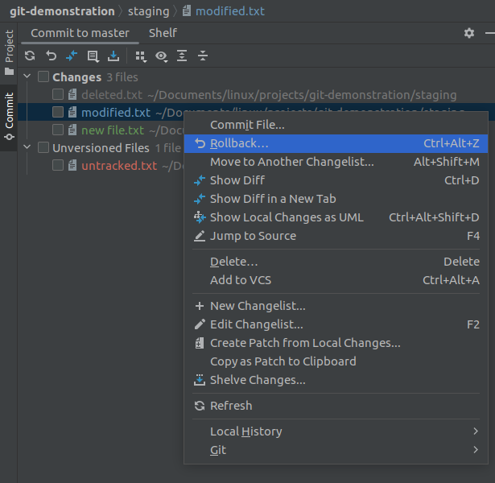
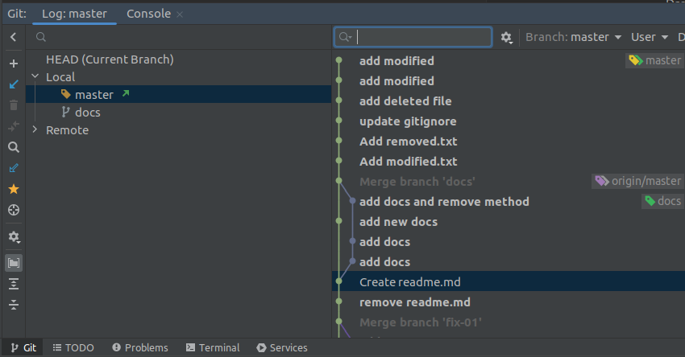
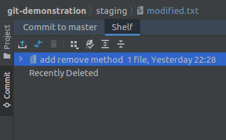

# Git Cheatsheet

- [Configuration](#configuration)
- [Starting a project](#starting-a-project)
- [Day-to-day work](#day-to-day-work)
- [Branching model](#branching-model)
- [Review your work](#review-your-work)
- [Synchronizing repositories](#synchronizing-repositories)
- [Temporary commits](#temporary-commits)
- [Tagging known commits](#tagging-known-commits)
- [Appendix A - Ignoring files](#appendix-a---ignoring-files)
- [Appendix B - Working areas](#appendix-b---working-areas)
- [Appendix C - Workflows in PhpStorm](#appendix-c---workflows-in-phpstorm)
- [References](#references)

## Configuration

`$ git config --global user.name “[your name]”`  
Set the name that will be attached to your commits and tags.

`$ git config --global user.email “[you@example.com]”`  
Set the email address that will be attached to your commits and tags.

`$ git config --global color.ui auto`  
Enable some colorization of the Git output.

`$ git config --global core.editor [notepad]`  
Set the editor which will be started to write commit messages. Default is *vi*.

`$ git config --global init.defaultBranch [name]`  
Since Git 2.28. Set a default branch name for the initial branch. Previously, it
was "master". The new recommendation is "main".

## Starting a project

`$ git init [project name]`  
Create a new local repository. If a project name is provided, Git will create a
new directory and will initialize a repository inside it. If no project name is
provided, then a new repository is initialized in the current directory.

`$ git clone [project url]`  
Download a project with the entire history from the remote repository.

> In the PhpStorm IDE

- Open a project on GitLab or GitHub to copy the URL for cloning the repository.
- Use "Clone with SSH" on GitLab as per our company guidelines.
- Open your PhpStorm IDE and navigate to "Git > Clone" in the top menu.
- Enter your project URL and select your working directory. Be aware that this
  directory can vary depending on your development setup (cf. WSL for local
  docker development).
- Click "Clone".

## Day-to-day work

`$ git status`  
List which files are staged, unstaged, and untracked. It will also retrieve the
branch name, the current commit ID (hash), and pending commits from the remote.

> In the PhpStorm IDE

- In your project tree you see the state of your files based on their colors.
    - **Ignored (yellow)**: This file is ignored based on the .gitignore file.
    - **Untracked (red)**: This file exists locally, but isn’t a part of the Git
      repository. Also, it will not be within the next commit. Use `git add` to
      stage the file for the next commit.
    - **New (green)**: This file will be committed but is new to the repository.
    - **Modified (blue)**: This file is already part of the repository but has
      changed since the last commit. That change will be committed.
    - **Deleted (grey)**: This change is in the repository but we be removed
      from it in the next commit.
    - **Unchanged**: This file has no changes since the last commit.

`$ git commit`  
Create a new commit from changes added to the staging area. A new text editor
will be launched to write a commit message.

`$ git commit -m “[descriptive message]”`  
Create a new commit from the changes added to the staging area, but instead of
launching a text editor, use the message directly as the commit message.

> In the PhpStorm IDE

- You can choose between "commit dialog" and "non-modal commit interface" (use
  second choice if in doubt)
- Select the files that you want to check into the repository (also stubs of a
  file are possible)
- Add a descriptive commit message
- Click "Commit" or "Commit and Push" (update the project before you push)
- Further advice:
    - Additionally you could select the option the run a code analyzer before
      the commit and further tools but I would advise against it. We should use
      more sophisticated tools for that in the near future.
    - Do not use "After commit upload files to". High risk to overwrite other
      changes. Let a pipeline do that for you.

`$ git add [file]`  
Add a file to the staging area. You can also use a glob pattern to add multiple
changed files at once.

> In the PhpStorm IDE

`$ git rm [file]”`  
Remove a file from the working direcory and the staging area.

> In the PhpStorm IDE

`$ git mv [existing file] [new file]”`  
Move an existing file and add it to the staging area.

> In the PhpStorm IDE

- Just rename the file. PhpStorm and Git will do that for you.

`$ git diff [file]`  
Show changes between the working directory and the staging area.

`$ git diff --staged [file]`  
Show any changes between the staging area and the repository.

> In the PhpStorm IDE

- Use the colored part right of the line numbers to see or discard changes.
- Double click the files in the commit interface to see a diff view.
    - You can choose between a side-by-side viewer and a unified viewer.
    - You can change how to handle white spaces.
    - You can collapse unchanged fragments which is useful for longer files.

`$ git checkout -- [file]`  
Discard file changes in the working directory. This operation is unrecoverable.

`$ git reset [commit]`  
Reset the staging area to match the commit (most recent commit if
omitted), but leave the working directory alone.

> In the PhpStorm IDE

`$ git reset --hard [commit]`  
Reset the staging area and the working directory to match the commit (most
recent commit if omitted). This overwrites all changes in the working directory.

## Branching model

`$ git branch [-a]`  
List all local and remote branches in the repository.

`$ git branch [branch name]`  
Create a new branch at the current commit (HEAD).

`$ git checkout [-b] [branch name]`  
Switch the working directory to the specified branch. With the `-b` option a new
branch with the name will be created.

`$ git merge [branch name]`  
Merge changes from specified branch into the current one. 

`$ git branch -d [branch name]`  
Remove a branch, if it is already merged into any other.

> In the PhpStorm IDE

- All of the options above can be found in the Git tab (`Alt+9`) or in the
  bottom right corner. You can see the local and the remote branches.

## Review your work

`$ git log`  
List the commit history of the current branch.

`$ git log [-5]`  
The option `-5` limits list to the last 5 commits.

`$ git log --oneline --graph --decorate`  
The option `--oneline` condenses each commit to a single line.  
The option `--graph` draws a text-based graph of commits on the left side of
the commit messages.  
The option `--decorate` adds names of branches or tags of the shown commits.

`$ git log -p`  
Display the full diff of each commit.

`$ git log --stat`  
Display which files were altered and the relative number of lines that were
added or deleted from each of the commits.

`$ git log --author=”[pattern]”`  
Search for commits by a particular author.

`$ git log --grep=”[pattern]”`  
Search for commits with a commit message that matches the [pattern].

`$ git log [since]..[until]`  
Show commits that occur between [since] and [until]. Arguments can be a commit
ID (hash), a branch name, HEAD, or any other kind of revision reference.

`$ git log -- [file]`  
Only display commits that modified the specified file.

`$ git log --follow [file]`  
Show the commits that changed a file, even across renames.

`$ git reflog`  
List operations (e.g. checkouts or commits) that were made on the local
repository.

`$ git show [hash]`  
Show any object in Git in a human-readable format.

> In the PhpStorm IDE

- The best option to see all the changes is with the Git tab (`Alt+9`). There
  you can navigate and filter through all the commits of all branches.

## Synchronizing repositories

`$ git remote add [alias] [url]`  
Create a new connection to a remote repository. Initially, the alias is called
'origin', but can be changed to any name.

`$ git fetch [alias] [branch]`  
Fetch changes from the remote branch, but does apply any changes to the local
repository.

`$ git merge [alias]/[branch]`  
Merge a remote branch into your current branch to brings it up to date.

`$ git pull [alias]`  
Fetch changes from the remote branch and merge the current branch with its
upstream.

`$ git push [alias] [branch]`  
Push the local changes to the remote repository. If the remote branch does not
exist, it will be created. Use the option `--tags` to push tags as well.

> In the PhpStorm IDE

- There are several options to achieve the task from above. All of them can
  perform approximately the same: 
    - Main menu under Git
    - Git tab
    - Branch selection in the bottom right
    - Task menu to the right
- Always try to update your project before you commit and push. With this
  strategy you can avoid additional merge commits and potentially conflicts
  during the merge.

## Temporary commits

`$ git stash`  
Put current changes of your working directory into stash for later use.

`$ git stash list`  
List stashed file changes.

`$ git stash pop`  
Apply stored stash content into the working directory and clear the stash.

`$ git stash drop`  
Delete a specific stash from all your previous stashes.

> In the PhpStorm IDE

- PhpStorm provides an even better way than stashing your changes and calls that
  concept "shelves". It also stores your changed files and will apply them again
  when you unshelve. You can also choose which specific parts of a file you want
  to shelve.

## Tagging known commits

`$ git tag`  
List all tags.

`$ git tag [name] [commit ID]`  
Create a new tag reference for the specified commit ID (uses the current commit
if argument is omitted).

`$ git tag -d [name]`  
Remove a tag from the local repository.

> In the PhpStorm IDE

- In the Git tab right click any commit and select "New Tag...". Be sure to also
  select "Push tags" once you push your code.

## Appendix A - Ignoring files

See [Appendix A - Ignoring files](01_ignoring-files.md)

## Appendix B - Working areas

See [Appendix B - Working areas](02_working-areas.md)

## Appendix C - Workflows in PhpStorm

See [Appendix C - Workflows in PhpStorm](03_workflows-in-phpstorm.md)

## References

- https://git-scm.com
- https://about.gitlab.com/images/press/git-cheat-sheet.pdf
- https://education.github.com/git-cheat-sheet-education.pdf
- https://www.atlassian.com/git/tutorials/atlassian-git-cheatsheet
- https://ndpsoftware.com/git-cheatsheet.html
